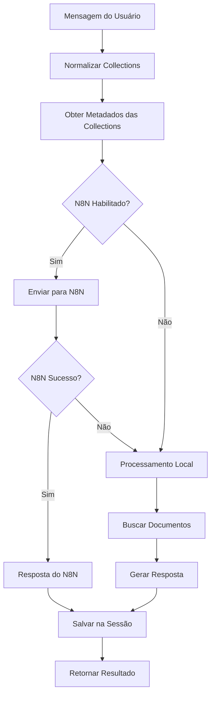

# Chat Service com Integração N8N

Este documento descreve as melhorias implementadas no `chat_rag_service.py` para integração com N8N e suporte a múltiplas collections.

## 🚀 Novas Funcionalidades

### 1. Integração com N8N
- **Webhook automático**: O chat service envia automaticamente requisições para o N8N
- **Fallback inteligente**: Se o N8N falhar, usa processamento local
- **Configuração flexível**: Pode ser habilitado/desabilitado via flag `use_n8n`

### 2. Suporte a Múltiplas Collections
- **Seleção flexível**: Usuário pode escolher uma, várias ou todas as collections
- **Busca abrangente**: Busca documentos em todas as collections selecionadas
- **Metadados detalhados**: Envia informações completas das collections para o N8N

### 3. Compatibilidade Mantida
- **API antiga**: Mantém suporte ao parâmetro `collection_name`
- **Métodos legados**: Preserva métodos antigos para compatibilidade
- **Migração suave**: Transição transparente para o novo sistema

## 📋 Estrutura dos Dados Enviados para N8N

### Payload do Webhook `/webhook/rag-chat`

```json
{
  "message": "Pergunta do usuário",
  "session_id": "uuid-da-sessao",
  "collections": [
    {
      "name": "collection-1",
      "embedding_model": "openai",
      "model_config": {
        "name": "OpenAI Text Embedding",
        "model": "text-embedding-3-small",
        "dimension": 1536,
        "provider": "openai"
      },
      "description": "Descrição da collection",
      "document_count": 150,
      "created_at": "2024-01-01T10:00:00",
      "vector_dimension": 1536,
      "model_provider": "openai"
    }
  ],
  "chat_history": [
    {
      "role": "user",
      "content": "Mensagem anterior",
      "timestamp": "2024-01-01T10:00:00"
    }
  ],
  "timestamp": "2024-01-01T10:00:00",
  "source": "rag-demo"
}
```

### Resposta Esperada do N8N

```json
{
  "response": "Resposta gerada pelo N8N",
  "sources": [
    {
      "text": "Texto do documento",
      "score": 0.95,
      "source_collection": "collection-1",
      "metadata": {
        "file_name": "documento.pdf",
        "chunk_index": 0
      }
    }
  ]
}
```

## 🔧 Configuração

### Variáveis de Ambiente

```env
# N8N Configuration
N8N_WEBHOOK_URL=http://localhost:5678/webhook
N8N_USERNAME=admin
N8N_PASSWORD=admin123
```

### Configuração no Docker Compose

O N8N já está configurado no `docker-compose.yml`:

```yaml
n8n:
  container_name: n8n
  image: n8nio/n8n:latest
  ports:
    - "5678:5678"
  environment:
    - N8N_BASIC_AUTH_ACTIVE=true
    - N8N_BASIC_AUTH_USER=admin
    - N8N_BASIC_AUTH_PASSWORD=admin123
```

## 📝 Como Usar

### 1. API REST

#### Múltiplas Collections (Novo)
```bash
curl -X POST http://localhost:5000/api/chat \
  -H "Content-Type: application/json" \
  -d '{
    "message": "Explique processamento de linguagem natural",
    "collection_names": ["nlp-docs", "ai-papers"],
    "session_id": "session-123"
  }'
```

#### Todas as Collections
```bash
curl -X POST http://localhost:5000/api/chat \
  -H "Content-Type: application/json" \
  -d '{
    "message": "Explique processamento de linguagem natural",
    "session_id": "session-123"
  }'
```

#### Collection Única (Compatibilidade)
```bash
curl -X POST http://localhost:5000/api/chat \
  -H "Content-Type: application/json" \
  -d '{
    "message": "Explique processamento de linguagem natural",
    "collection_name": "nlp-docs",
    "session_id": "session-123"
  }'
```

### 2. Código Python

```python
from src.chat_rag_service import ChatManager

# Inicializar chat manager
chat_manager = ChatManager()

# Criar sessão
session_id = chat_manager.create_session()

# Chat com múltiplas collections
result = chat_manager.chat(
    session_id=session_id,
    message="Explique machine learning",
    collection_names=["ml-books", "ai-papers"]
)

print(result['response'])
print(f"Collections usadas: {result['collections_used']}")
print(f"Processado por: {result['processed_by']}")  # 'n8n' ou 'local'
```

## 🔄 Fluxo de Processamento



## 🛠️ Configuração do Workflow N8N

### Webhook Node
- **URL**: `/webhook/rag-chat`
- **Method**: POST
- **Response**: JSON

### Exemplo de Workflow Básico

1. **Webhook Trigger**: Recebe dados do chat
2. **Code Node**: Processa collections e mensagem
3. **HTTP Request**: Chama APIs externas se necessário
4. **Response Node**: Retorna resposta formatada

### Template de Código N8N

```javascript
// Código de exemplo para processar no N8N
const collections = $json.collections;
const message = $json.message;

// Lógica personalizada baseada nas collections
if (collections.some(c => c.name.includes('legal'))) {
  // Processamento específico para documentos legais
} else if (collections.some(c => c.name.includes('technical'))) {
  // Processamento específico para documentos técnicos
}

return {
  response: "Resposta processada pelo N8N",
  sources: []
};
```

## 🐛 Solução de Problemas

### N8N Não Responde
- Verificar se o N8N está rodando: `http://localhost:5678`
- Verificar logs do container: `docker logs n8n`
- Testar webhook manualmente

### Collections Não Encontradas
- Verificar se as collections existem no Qdrant
- Verificar se os nomes estão corretos
- Usar `get_collections()` para listar disponíveis

### Fallback Local
- Verificar configuração do N8N
- Verificar conectividade de rede
- Logs mostrarão quando fallback é usado

## 📊 Monitoramento

### Logs Importantes
```
✅ Collection 'nlp-docs' criada com modelo 'openai'
⚠️ N8N falhou, usando processamento local como fallback  
📊 Processamento por N8N concluído em 1.2s
```

### Métricas
- Tempo de resposta N8N vs Local
- Taxa de sucesso do N8N
- Collections mais utilizadas
- Sessões ativas

## 🔗 Referências

- [Configuração N8N](../workflows_n8n.md)
- [API Documentation](../README.md#apis-disponíveis)
- [Vector Store](./VECTOR_STORE.md) 